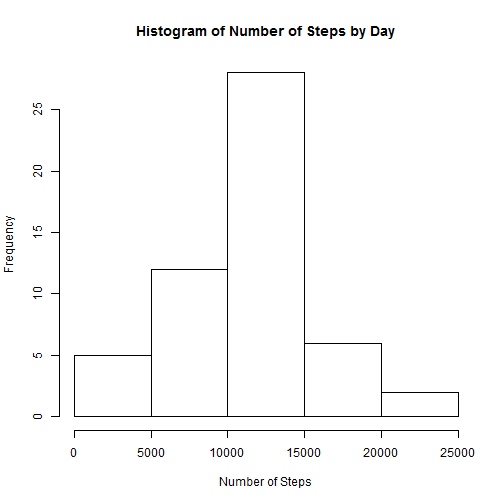
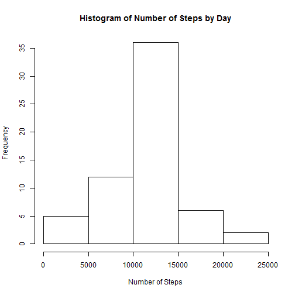
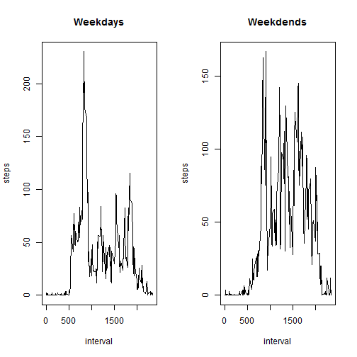

Reproducible Research Assignment 1
==================================
This is the first assignment in Reproducible Research.  We are working with the activity dataset which contains information regarding the number of steps taken within each 5 minute interval throughout 47 days.

First we load the data into R:

```r
activity = read.csv("repdata_data_activity/activity.csv",header = TRUE)
activity2 = subset(activity, is.na(steps)==0)
```


Next we aggregate the total number of steps by day and create a histogram

```r
stepsbyday = aggregate(steps~date,data = activity2,sum)
hist(stepsbyday$steps, xlab = 'Number of Steps',main = 'Histogram of Number of Steps by Day')
```



Here we have the average number of steps taken per day

```r
mean(stepsbyday$steps)
```

```
## [1] 10766.19
```

And the median number of steps taken per day

```r
median(stepsbyday$steps)
```

```
## [1] 10765
```

Now we are aggregating the number of steps by each interval

```r
stepsbyinterval = aggregate(steps~interval, data = activity2,mean)
with(stepsbyinterval,plot(interval,steps, type = 'l'))
```


Below we see that interval 835 has the most steps on average

```r
subset(stepsbyinterval, steps==max(stepsbyinterval$steps))
```

```
##     interval    steps
## 104      835 206.1698
```

Here we see that the total number of missing values is 2304:

```r
sum(is.na(activity$steps)==1)
```

```
## [1] 2304
```


Creating a new dataset, fillin, that has each of the NA values equal to the mean of the non-Null values from that interval over the 47 days

```r
fillin = activity
for(i in 1:length(fillin$steps)){
    if(is.na(fillin$steps[i]) == 1){
        A = subset(fillin,is.na(fillin$steps)==0 & 
                     interval == fillin$interval[i])
        fillin$steps[i]=mean(A$steps)
    }
}
```

Recreating the Histogram, mean and median shows that there are slightly more total number of steps per day when we change out an NA for a mean value, since that value represents a number greater than 0, and NA was being marked as 0.

```r
stepsbyday2 = aggregate(steps~date,data = fillin,sum)
hist(stepsbyday2$steps, xlab = 'Number of Steps',main = 'Histogram of Number of Steps by Day')
```




```r
mean(stepsbyday2$steps)
```

```
## [1] 10766.19
```

```r
median(stepsbyday2$steps)
```

```
## [1] 10766.19
```

We add whether or not it is a weekday to a new column in the data frame fillin

```r
for(i in 1:length(fillin$date)){
    if(weekdays(as.Date(fillin$date[i]))== "Sunday" |
       weekdays(as.Date(fillin$date[i]))== "Saturday"){
           fillin$day[i]='weekend'
    }
    else{
      fillin$day[i]='weekday'
    }
  
}
```

plot side by side the average number of steps of weekdays vs weekends for each interval

```r
par(mfrow = c(1,2))
weekday = aggregate(steps~interval,data = subset(fillin,day == 'weekday'),mean)
weekend = aggregate(steps~interval,data = subset(fillin,day == 'weekend'),mean)
with(weekday,plot(interval,steps, type = 'l', main = 'Weekdays'))
with(weekend,plot(interval,steps, type = 'l', main = 'Weekdends'))
```


